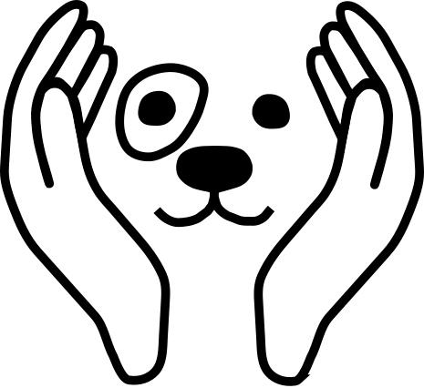

# FurEverFriends - Pet Care App
FurEverFriends is a web-based pet care application that can be used by pet holders to find a pet sitter for their pets that live nearby.

Note: This is a prototype for the project work for the TUM course "Software Engineering for Business Applications - Master's Course".

## Participants
- Alexander Waldner ([alexander.waldner@tum.de](mailto:alexander.waldner@tum.de))
- Jonas Geiger ([jonas.geiger@tum.de](mailto:jonas.geiger@tum.de))
- Lorenz Mangold ([ge64zon@mytum.de](mailto:ge64zon@mytum.de)) 
- Maximilian Josef Frank ([maximilian.j.frank@tum.de](mailto:maximilian.j.frank@tum.de))

## Getting Started
### Docker
```sh
sudo docker compose build
sudo docker compose up -d
sudo docker compose down # for shutdown
```

### NPM
1. start backend
    ```sh
    cd backend
    npm install && npm start # or npm run dev
    ```
2. start frontend
    ```sh
    cd frontend
    npm install && npm start # or npm run test
    ```

## Development
### Stack
FurEverFriends is built and based on the MERN Stack:
- [MongoDB](https://www.mongodb.com/)
- [Express](https://expressjs.com/)
- [React](https://react.dev/)
- [Node.js](https://nodejs.org/)
